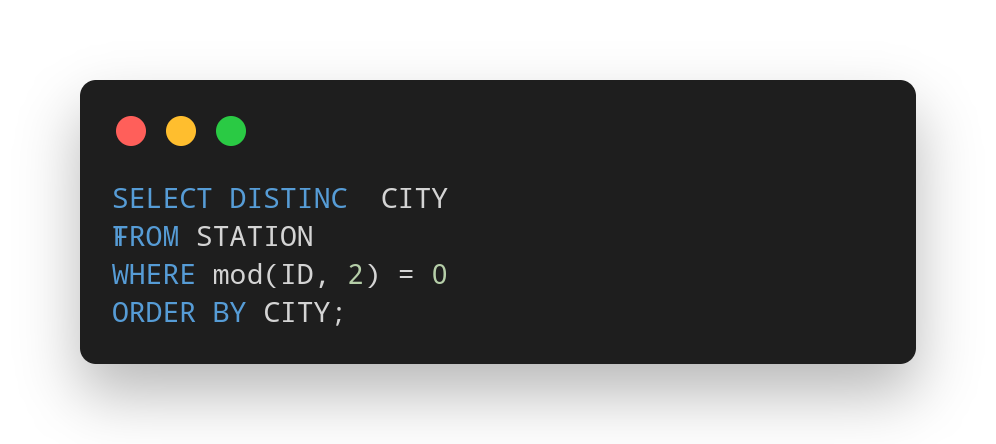
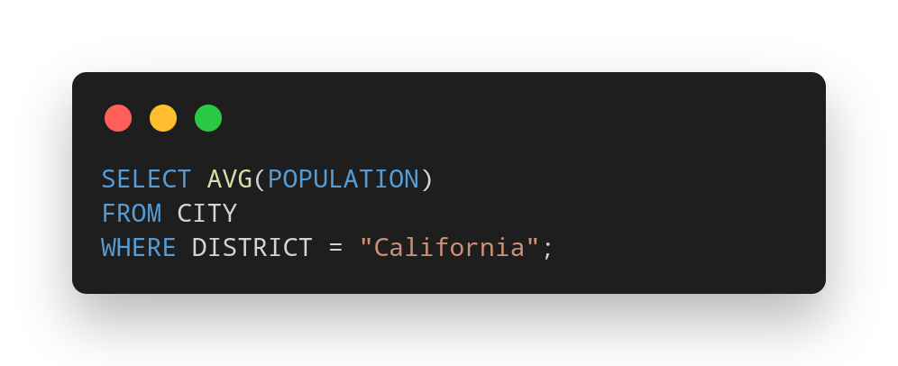
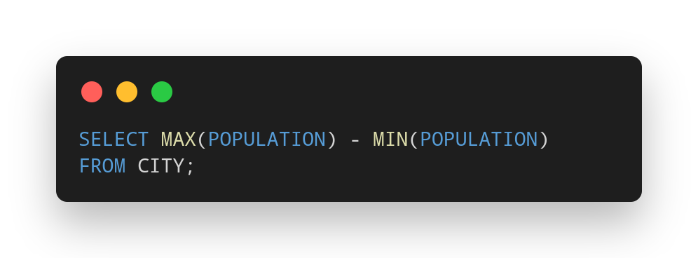
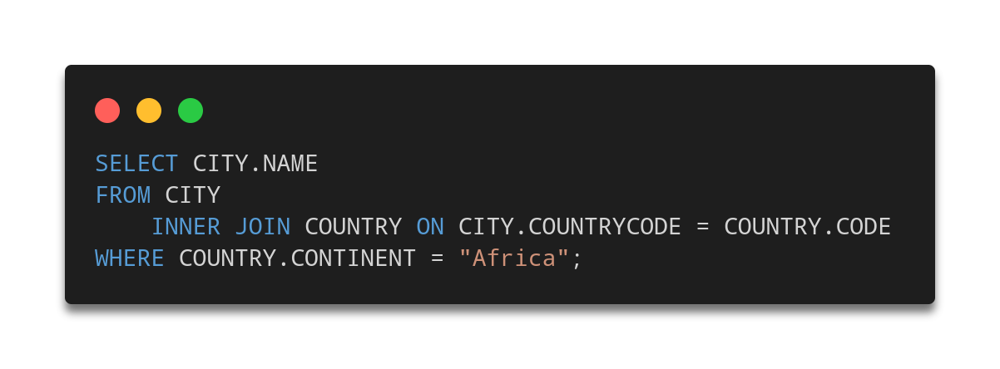
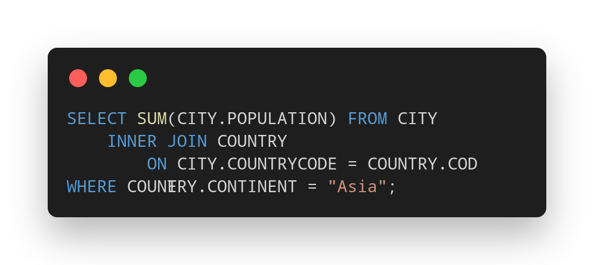
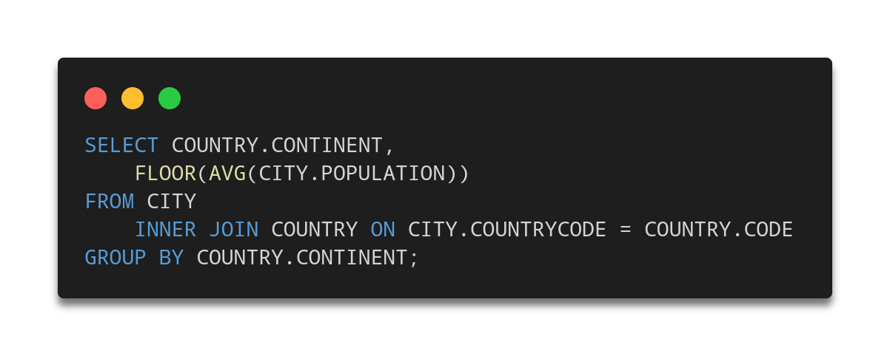

# Section 1

## 1. Revising the Select Query I

https://github.com/2navidmasoudi/MaktabSharif70/blob/3a54df3681dd392a5cc4c7f774931c5c1248eecd/HW-11/Section_1/1.sql#L3-L6

## 2. Revising the Select Query II

https://github.com/2navidmasoudi/MaktabSharif70/blob/3a54df3681dd392a5cc4c7f774931c5c1248eecd/HW-11/Section_1/2.sql#L3-L6

## 3. Select All

https://github.com/2navidmasoudi/MaktabSharif70/blob/3a54df3681dd392a5cc4c7f774931c5c1248eecd/HW-11/Section_1/3.sql#L3

## 4. Select By ID

https://github.com/2navidmasoudi/MaktabSharif70/blob/3a54df3681dd392a5cc4c7f774931c5c1248eecd/HW-11/Section_1/4.sql#L3-L5

# Section 2

## 1. Weather Observation Station 3

https://github.com/2navidmasoudi/MaktabSharif70/blob/2b6fc94c383c6d9dc6d0403c85deeedcb24f2cdd/HW-11/Section_2/1.sql#L3-L6

## 2. Employee Names

https://github.com/2navidmasoudi/MaktabSharif70/blob/2b6fc94c383c6d9dc6d0403c85deeedcb24f2cdd/HW-11/Section_2/2.sql#L3-L5

## 3. Employee Salaries

https://github.com/2navidmasoudi/MaktabSharif70/blob/2b6fc94c383c6d9dc6d0403c85deeedcb24f2cdd/HW-11/Section_2/3.sql#L3-L7

# Section 3

## 1. Revising Aggregations - The Count Function

https://github.com/2navidmasoudi/MaktabSharif70/blob/d13a4a299c64118892b1e271352ef8151fab1f0e/HW-11/Section_3/1.sql#L3-L5

## 2. Revising Aggregations - The Sum Function

https://github.com/2navidmasoudi/MaktabSharif70/blob/d13a4a299c64118892b1e271352ef8151fab1f0e/HW-11/Section_3/2.sql#L3-L5

## 3. Revising Aggregations - Averages

https://github.com/2navidmasoudi/MaktabSharif70/blob/d13a4a299c64118892b1e271352ef8151fab1f0e/HW-11/Section_3/3.sql#L3-L5

## 4. Average Population

https://github.com/2navidmasoudi/MaktabSharif70/blob/d13a4a299c64118892b1e271352ef8151fab1f0e/HW-11/Section_3/4.sql#L3-L4

## 5. Population Density Difference

https://github.com/2navidmasoudi/MaktabSharif70/blob/d13a4a299c64118892b1e271352ef8151fab1f0e/HW-11/Section_3/5.sql#L3-L4

# Section 4

## 1. African Cities

https://github.com/2navidmasoudi/MaktabSharif70/blob/3ddc215d66e2a51bb49a1f35a52a66ab930ae867/HW-11/Section_4/1.sql#L3-L6

## 2. Population Census

https://github.com/2navidmasoudi/MaktabSharif70/blob/3ddc215d66e2a51bb49a1f35a52a66ab930ae867/HW-11/Section_4/2.sql#L3-L6

## 3. Average Population of Each Continent

https://github.com/2navidmasoudi/MaktabSharif70/blob/3ddc215d66e2a51bb49a1f35a52a66ab930ae867/HW-11/Section_4/3.sql#L3-L7

